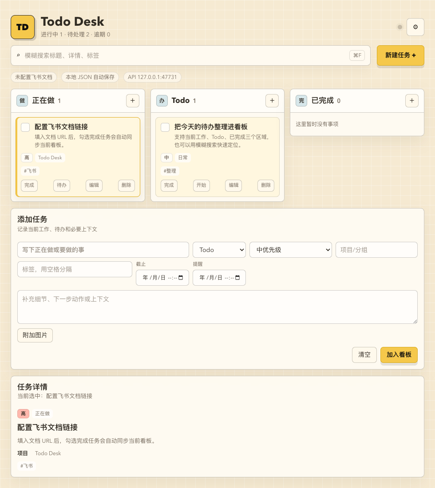
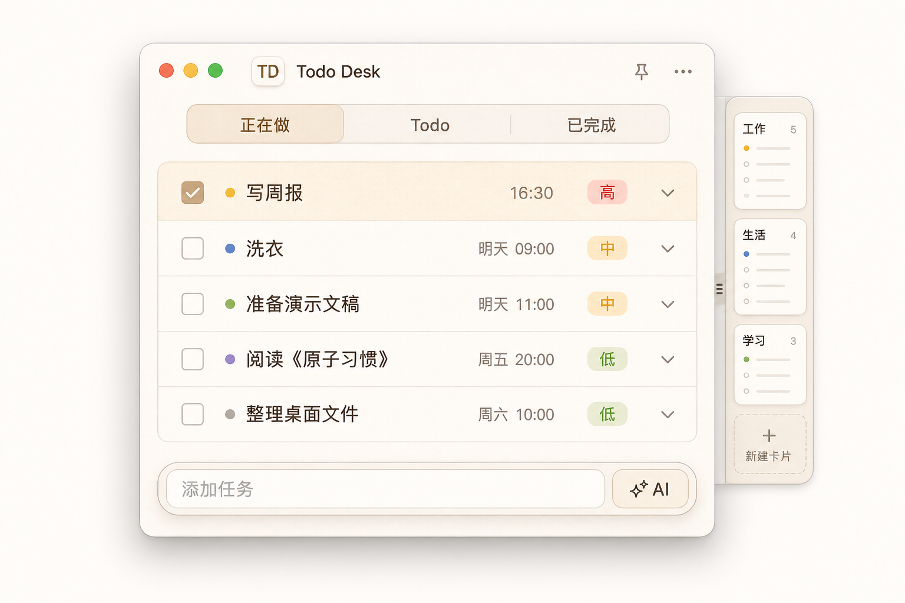
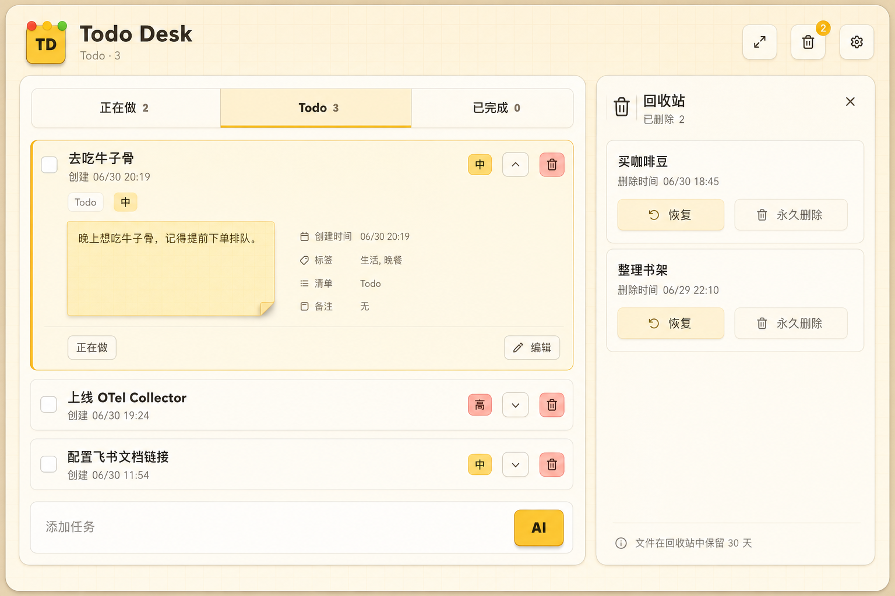

# Todo Desk

一个便笺风格的桌面 Todo 工具。它用 Electron 提供桌面窗口、吸边、本地 JSON 存储和飞书 CLI 同步，用 React/Vite 提供跨端 UI。



小卡独立界面原型：



本轮 UI 修改建议稿：



## 已实现

- 当前工作 / Todo / 已完成三段看板
- 任务卡片可在“正在做 / Todo / 已完成”之间拖拽移动
- 正常模式和小卡模式切换；小卡模式只展示一个指定列表
- 拖到左右屏幕边缘后进入贴边长条状态，减少遮挡
- 添加任务支持“只填文本”和“详细表单”两种模式；文本模式可一次输入多件事并拆成多条任务
- 可配置 AI Base URL / Model / API Key，添加任务时自动识别多任务、图片内容、时间、优先级、项目和标签
- 每个任务卡片都会显示时间，优先展示完成、截止、提醒时间，否则展示创建时间
- 左侧勾选完成，完成时可自动同步飞书
- 已完成事项永久保留，按完成时间倒序展示
- 删除任务先进入独立回收箱，可恢复或永久删除
- 模糊搜索标题、详情、标签、项目和日期
- 本地 JSON 数据恢复，数据文件可从界面按钮直接定位
- 飞书文档 URL/token 配置，调用 `lark-cli docs +update --mode append`
- 截止时间、提醒时间、项目/分组、标签、优先级
- 到点 macOS 桌面提醒，可在设置里关闭；带提醒/截止时间的任务可以一键生成系统日历事件
- 附加图片，桌面端会复制到应用数据目录；支持从文件选择或剪贴板粘贴截图；AI 会优先使用模型视觉能力，不支持图片时退回本机 OCR
- 置顶和靠近屏幕边缘自动吸边
- 本机 `127.0.0.1` API，方便 Codex/Claude/Cursor 等 AI 把当前工作写入 Todo Desk，也支持 agent/session/repo 元数据和状态更新
- 配套 Codex skill：`/Users/dxm/.codex/skills/todo-desk`
- 拉库后一键配置 Codex / Claude / Kimi / Cursor 等 agent 使用 Todo Desk：`npm run agent:install`
- 浏览器降级模式：没有 Electron 时用 `localStorage`，方便后续扩展 PWA/移动端

## 本地运行

```bash
npm install
npm run dev
```

只看 Web UI：

```bash
npm run web:dev
```

## 打包

生成 macOS 可运行 `.app` 目录包：

```bash
npm run build
npx electron-builder --mac --dir
```

当前产物路径：

```text
/Users/dxm/Documents/Codex/2026-06-30/todo-todo/outputs/todo-desk-release/mac-arm64/Todo Desk.app
```

`npm run dist` 会尝试生成 DMG/zip。当前机器没有有效 Apple Developer ID，签名会跳过；这不影响 `--dir` 生成的 `.app` 在本机打开，但正式分发给别人前需要补签名和公证。

## 原生构建

可以改成原生构建，但需要先选目标：

- 只追求 macOS 体验：用 SwiftUI + AppKit 重写窗口、吸边、菜单和通知，继续复用现在的 JSON 数据结构、飞书 CLI 调用和 AI 解析逻辑。这条路桌面体验最好，但不跨端。
- 想减少 Electron 套壳又保留跨端：迁到 Tauri，React UI 大部分可以复用，后端改成 Rust/WebView 能减体积，也比完全重写稳。
- 想移动端也一起做：Flutter 或 React Native 可行，但要重做桌面窗口细节，投入最大。

当前版本还是 Electron。短期如果要摆脱笨重套壳，我更建议先做 Tauri 迁移；如果只要 Mac 端便笺体验，才值得直接做 SwiftUI 版。

## 数据位置

macOS 下 Electron 数据默认在：

```text
~/Library/Application Support/todo-desk/todo-desk-data.json
~/Library/Application Support/todo-desk/attachments/
```

数据文件是普通 JSON，适合备份和迁移。

主要字段：

- `tasks`：正常看板里的任务。
- `trash`：删除过的任务，额外带 `deletedAt`，恢复时会回到 `tasks`。
- `syncLog`：飞书同步记录。
- `settings`：窗口、AI、本机 API 和飞书配置。

## 本机 AI 写入接口

Todo Desk 启动后默认监听：

```text
http://127.0.0.1:47731
```

接口只接受本机回环地址请求。可以在 App 右上角齿轮的“后台设置”里关闭接口或修改端口。

健康检查：

```bash
curl http://127.0.0.1:47731/health
```

添加一条当前工作：

```bash
curl -X POST http://127.0.0.1:47731/tasks \
  -H 'Content-Type: application/json' \
  -d '{
    "title": "Codex 正在处理 Todo Desk",
    "detail": "记录当前 AI 工作内容和下一步动作",
    "status": "doing",
    "priority": "medium",
    "project": "AI 工作",
    "tags": "codex todo-desk",
    "source": "codex",
    "agent": "codex",
    "agentSessionId": "019-session-id",
    "repository": "todo-desk",
    "repositoryPath": "/Users/dxm/Documents/Codex/2026-06-30/todo-todo/work/todo-desk"
  }'
```

任务 JSON 可以带 `images` 或 `imagePaths`，值可以是图片路径字符串数组，也可以是 `{ "name": "...", "path": "...", "url": "file://..." }` 对象数组。API 会把这些图片引用保存到任务里，图片文件本身需要调用方保证存在。

agent 相关字段用于把任务挂到某个 AI 和它的会话上：

- `source`：来源，例如 `codex`、`claude`、`cursor`、`api`。
- `agent`：处理该任务的 agent 名称。
- `agentSessionId`：agent 的会话、线程或 run id。
- `repository`：代码库短名，适合做任务 tag 或筛选。
- `repositoryPath`：本地代码库路径。

更新任务状态或补充处理记录：

```bash
curl -X PATCH http://127.0.0.1:47731/tasks/<task-id> \
  -H 'Content-Type: application/json' \
  -d '{
    "status": "doing",
    "agent": "codex",
    "agentSessionId": "019-session-id",
    "repository": "todo-desk",
    "appendDetail": "Codex 已开始处理 AI 合并反馈问题"
  }'
```

完成时：

```bash
curl -X PATCH http://127.0.0.1:47731/tasks/<task-id> \
  -H 'Content-Type: application/json' \
  -d '{
    "status": "done",
    "appendDetail": "已完成实现并通过本地验证"
  }'
```

批量添加多条工作：

```bash
curl -X POST http://127.0.0.1:47731/tasks \
  -H 'Content-Type: application/json' \
  -d '{
    "tasks": [
      {
        "title": "整理飞书同步测试用例",
        "status": "todo",
        "priority": "medium",
        "project": "QA",
        "tags": "feishu test"
      },
      {
        "title": "确认 App icon",
        "status": "done",
        "priority": "low",
        "project": "Todo Desk",
        "tags": "icon"
      }
    ]
  }'
```

也可以直接用配套 skill 脚本：

```bash
python3 /Users/dxm/.agents/skills/todo-desk/scripts/add_work.py \
  --title "当前 AI 工作" \
  --detail "正在处理某个需求" \
  --status doing \
  --priority medium \
  --project "AI 工作" \
  --tags codex,todo \
  --agent codex \
  --agent-session-id "019-session-id" \
  --repository "todo-desk" \
  --repository-path "/path/to/todo-desk" \
  --due-at "2026-07-01T18:00:00+08:00" \
  --reminder-at "2026-07-01T17:30:00+08:00"
```

## Agent 自动接入

从 GitHub 拉下仓库后，先启动 Todo Desk，再运行：

```bash
npm install
npm run agent:install -- --dry-run
npm run agent:install
```

脚本会把仓库内 `skills/todo-desk` 同步到 Codex、Claude、Kimi、Cursor 和通用 `~/.agents` skill 目录，并在各 agent 的全局指令/规则里写入 Todo Desk 工作挂载规则。写入是幂等的，使用 `todo-desk-agent-bootstrap` marker 管理，重复运行只会更新同一段内容。

详细设计见 [docs/agent-bootstrap.md](docs/agent-bootstrap.md)。

## AI 元数据识别

在右上角齿轮里打开“添加任务时启用 AI 解析”，填写兼容 OpenAI Chat Completions 的 `Base URL`、`Model` 和可选 `API Key`。文本添加模式下可以输入一句话，也可以一次输入多件事，例如“今天修 release；明天下午 3 点提醒我整理周报；已经完成 App icon”，应用会让模型返回结构化 JSON，并自动创建多条任务，填充标题、详情、状态、优先级、项目、标签、截止时间和提醒时间。

附加图片后可以不输入文字。可以点“附加图片”选择文件，也可以在添加任务输入区域直接 `⌘V` 粘贴截图，或点“粘贴图片”读取当前剪贴板图片。桌面端会把图片作为 Chat Completions `image_url` 内容发送给模型；如果模型或网关返回不支持图片、多模态或 `image_url`，应用会调用本机 `tesseract` 做 OCR，再把识别出的文字交给同一个任务解析流程。OCR 只是后备能力，中文截图最好使用支持视觉的模型，或者给 Tesseract 安装中文语言数据。应用会自动优先选择本机存在的 `chi_sim`、`chi_tra`、`eng`，没有中文语言包时会退回 `eng`。

这部分只在本机 Electron 进程里发起请求，配置保存在本地 JSON 文件中；浏览器降级模式不会调用 AI。

多选任务后可以使用“AI 合并”。合并时会显示“AI 合并中”，请求超过 45 秒会返回明确失败提示；如果 Base URL 没带 `/v1` 且网关需要 `/v1/chat/completions`，应用会自动尝试 fallback。模型返回 `{"title":"","detail":""}`、Markdown fenced JSON、或 `description` 字段时都能解析，合并成功后会创建新任务，原任务进入回收箱。

可以用下面的命令检查当前 AI 和图片解析链路：

```bash
npm run test:ai
```

## 提醒和手机同步

当前已落地两种提醒能力：

- macOS 桌面提醒：设置里打开“到点弹出 macOS 提醒”，任务到 `reminderAt` 后会弹系统通知，并写入 `remindedAt` 避免重复提醒。Electron 官方 Notification 文档说明 macOS 通知底层使用 Apple `UNNotification`，正式分发时应做代码签名；未签名本机包在某些系统设置下通知可能不稳定。参考：[Electron Notifications](https://electronjs.org/docs/latest/tutorial/notifications)、[Electron Notification API](https://electronjs.org/docs/latest/api/notification)。
- 系统日历提醒：任务有 `reminderAt` 或 `dueAt` 时，展开任务卡后会出现“日历”按钮。点击后应用会生成 `.ics` 文件并交给系统日历打开。这个方式不绑定品牌，macOS Calendar、Google Calendar、飞书日历或其他能导入 `.ics` 的日历都可以接住；只要手机也同步同一个日历账号，就能在手机上收到提醒。

移动端/手机提醒的可行路径：

- Android 原生 App：可以用 Android Calendar Provider 写入系统日历事件和提醒。Android 官方文档说明 Calendar Provider 支持对 calendars、events、attendees、reminders 做 query/insert/update/delete，适合把 Todo Desk 的 `dueAt/reminderAt` 同步成手机日历提醒。参考：[Android Calendar Provider](https://developer.android.com/identity/providers/calendar-provider)。
- 云日历：后续可以接 Google Calendar API 或飞书日历 API，桌面端把任务同步到云日历，手机通过系统日历 App 接收提醒。这条跨品牌最好，但需要 OAuth/云账号授权。
- vivo 手机厂商推送：不能由当前 Electron 桌面 App 直接推到 vivo 手机。vivo 官方消息推送面向移动应用/服务端推送链路，官方文档中心提到服务端 SDK 和 HTTP API；第三方厂商通道文档也要求先在 vivo 开放平台申请推送服务，拿到 AppID/AppKey/AppSecret，再把 vivo Push SDK 接入 Android App。也就是说，要做 vivo 原生提醒，需要新增 Android 客户端或接入已有移动端。参考：[vivo 消息推送](https://developers.vivo.com/product/d/messagePush)、[vivo 文档中心](https://developers.vivo.com/doc/d/6b683b474cf64fdab1a0738035c8868e)、[vivo 通道接入准备](https://help.aliyun.com/en/document_detail/434679.html)。

短期已经实现的是 macOS 本地通知和 `.ics` 日历导入；如果要真正的手机自动同步，下一步更建议先做云日历同步，再考虑 vivo Push。

## 飞书同步

先确认本机 `lark-cli` 已登录可用：

```bash
lark-cli auth status
```

在应用里填入飞书文档 URL 或 token，保持“完成后同步”开启。勾选完成任务后，应用会追加一段 Markdown 到飞书文档，内容包括：

- 当前正在做
- 未完成 Todo
- 已完成

当前同步是“应用到飞书文档”的备份/快照，不从飞书文档反向恢复结构化数据。如果后续要做真正双向云同步，建议改用飞书多维表格或云空间 JSON 文件。
